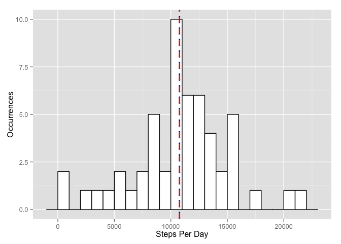
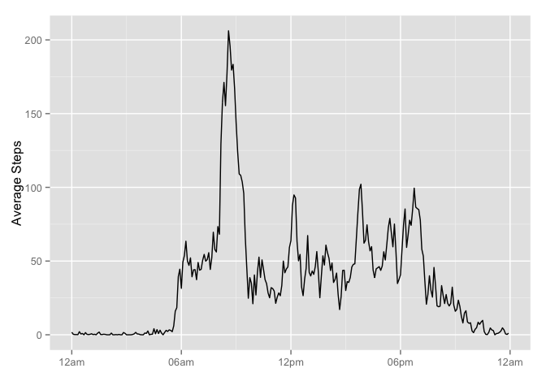
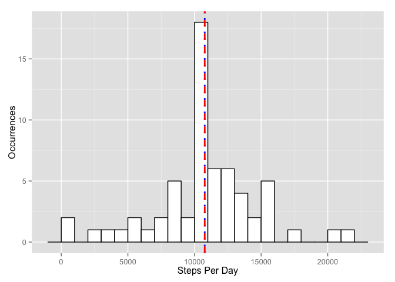
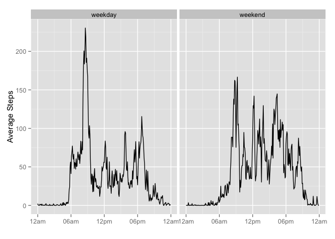

# Reproducible Research: Peer Assessment 1


## Loading and preprocessing the data
This data comes from a personal activity monitoring device. This device collects data at five minute intervals
through out the day. The data consists of two months of data from an anonymous individual collected during the months of 
October and November, 2012 and include the number of steps taken in five minute intervals each day.

Data is available in the current working directory in the compressed file, activity.zip. The following code loads the data and
creates a time variable (attached to a future date (2025-01-01) for later presentation purposes.

The date variable is converted to type Date, from a string format.

```r
df <- read.csv(unz('activity.zip', 'activity.csv'), stringsAsFactors=F)
df$date <- as.Date(df$date)
df$day <- weekdays(df$date) # Calculate the day of week for later weekday/weekend use

# Convert to a future date so we can have all times within one day
futuretime <- strptime(                        
                      paste(future.date, 
                           sprintf('%04d', df$interval), 
                           sep=' '),
                     '%Y-%m-%d %H%M')
df$time <- as.POSIXct(futuretime, format = "%H:%M")
```

## What is mean total number of steps taken per day?

Inspection of the data yields a 13.1% missing value rate for steps. 
Ignoring these missing values, aggregate the total number of steps taken by day and calculate mean and median values.

### Calculate the total number of steps per day
Calculate and save the total number of steps per day to display histogram and calculate mean/median in the following fashion.

```r
steps.per.day <- aggregate(steps ~ date, data=df, FUN=sum)
head(steps.per.day) # Inspect the resulting data
```

```
##         date steps
## 1 2012-10-02   126
## 2 2012-10-03 11352
## 3 2012-10-04 12116
## 4 2012-10-05 13294
## 5 2012-10-06 15420
## 6 2012-10-07 11015
```

### Histogram of the total number of steps taken each day
Display a histogram of number of steps taken each day, noting the mean (in a dotted blue line) and 
median (in a red dashed line) as described by the code below.

```r
ggplot(data=steps.per.day, aes(steps.per.day$steps)) + 
  geom_histogram(color='black', fill='white', binwidth=1000) +
  geom_vline(aes(xintercept=mean(steps.per.day$steps, na.rm=T)), 
             color='blue', linetype='dotted', size=1) +
  geom_vline(aes(xintercept=median(steps.per.day$steps, na.rm=T)), 
             color='red', linetype='dashed', size=1) +
  xlab('Steps Per Day') + 
  ylab('Occurrences')
```

 

### Mean and Median of the total number of steps taken each day
The following code calculates and displays the mean and median of total number of steps per day, ignoring missing values.

```r
mean.steps.per.day <- mean(steps.per.day$steps, na.rm=T)
median.steps.per.day <- median(steps.per.day$steps, na.rm=T)
```
- *Mean* steps per day is **10,766.19**.
- *Median* steps per day is **10,765**.

## What is the average daily activity pattern?
Create a time series plot of the five-minute interval (x-axis) and the average number of steps taken, 
averaged across all days (y-axis).

```r
# Aggregate steps by five minute periods (previously converted into the $time variable)
average.steps.per.period <- aggregate(steps ~ time, data=df, FUN=mean, na.rm=T)

# Plot the time series
ggplot(data=average.steps.per.period, aes(time, steps)) +
  geom_line() +
  scale_x_datetime(labels=date_format('%I%P')) +
  xlab('') +
  ylab('Average Steps')
```

 

### Most active interval
The time series plot shows the most active interval to be somewhere prior to 9am. The exact determination is found with
the following code.

```r
# Interval with maximum steps
interval <- average.steps.per.period[which.max(average.steps.per.period$steps), ]
```
The most active five minute interval is at **08:35am**.

## Imputing missing values
Inspection of the data reveals the individual is missing data for an entire day for eight of the 61 days being monitored.

```r
intervals <- unique(df$interval)
unique(lapply( intervals, function(x) { df[df$interval==x & is.na(df$steps), 'date'] } ))
```

```
## [[1]]
## [1] "2012-10-01" "2012-10-08" "2012-11-01" "2012-11-04" "2012-11-09"
## [6] "2012-11-10" "2012-11-14" "2012-11-30"
```

### Total missing values
The following code counts the number of rows with missing steps in the dataset and also calculates a percentage missing.

```r
count.na <- length(df$steps[is.na(df$steps)])
count.total <- length(df$steps)
percent.missing <- count.na / count.total
```

There are **2,304** rows in the dataset that have missing values. 
The total number of rows in the dataset is **17,568**.
This yields a **13.1%** missing value rate for steps. 

Given the high rate of missing values for steps at various intervals, and the fact the data is missing for an entire day,
we will fill the missing values by using five minute interval averages to fill in the missing values. Approximate the missing
data for each row in the dataframe and use that data to replace the missing values for steps.

```r
average.steps.per.interval <- aggregate(steps ~ interval, data=df, FUN=mean)
df.filled <- merge(df, average.steps.per.interval, by.x='interval', by.y='interval')

# Rename the steps columns to something more meaningful than steps.x and steps.y
names(df.filled)[names(df.filled) == 'steps.x'] <- 'steps'
names(df.filled)[names(df.filled) == 'steps.y'] <- 'steps.average'
df.filled[which(is.na(df.filled$steps)), 'steps'] <- df.filled[which(is.na(df.filled$steps)), 'steps.average']
```

### Histogram of steps taken each day with missing values imputed
Using the data wieht imputed values, display a histogram of number of steps taken each day, 
noting the mean (in a dotted blue line) and median (in a red dashed line) as described by the code below.

```r
# Using the new data set with imputed values, calculate the new steps per day
steps.per.day <- aggregate(steps ~ date, data=df.filled, FUN=sum)

ggplot(data=steps.per.day, aes(steps.per.day$steps)) + 
  geom_histogram(color='black', fill='white', binwidth=1000) +
  geom_vline(aes(xintercept=mean(steps.per.day$steps, na.rm=T)), 
             color='blue', linetype='dotted', size=1) +
  geom_vline(aes(xintercept=median(steps.per.day$steps, na.rm=T)), 
             color='red', linetype='dashed', size=1) +
  xlab('Steps Per Day') + 
  ylab('Occurrences')
```

 

### Mean and Median of the total number of steps taken each day (with imputed values)
The following code calculates and displays the mean and median of total number of steps per day, *imputing* missing values.

```r
mean.steps.per.day <- mean(steps.per.day$steps, na.rm=T)
median.steps.per.day <- median(steps.per.day$steps, na.rm=T)
```
- *Mean* steps per day is **10,766.19**.
- *Median* steps per day is **10,766.19**.

There is a **negligible impact** on the mean and median of the data by imputing the values using the average of the five minute period for the missing data.

## Are there differences in activity patterns between weekdays and weekends?
The code below aggregates the data by taking the mean of the five minute time periods separately for both weekdays and weekend days. It then creates time series plots in two panels to differentiate the weekday vs. weekend activity.


```r
day.types = as.factor(c('weekday', 'weekend'))
# The following %in% returns 0 or 1, add 1 to find correct day.type factor.
df.filled$day.type <- day.types[df.filled$day %in% c('Saturday', 'Sunday')+1]

average.steps.per.period.day.type <- aggregate(steps ~ time+day.type, data=df.filled, FUN=mean)

ggplot(data=average.steps.per.period.day.type, aes(time, steps)) +
  facet_wrap(~day.type) +
  geom_line() +
  scale_x_datetime(labels = date_format('%I%P')) +
  xlab('') +
  ylab('Average Steps')
```

 

Review the results from the plots, it appears the individual sleeps in a little later during the weekends and there is not a rush to get to the morning destination (be it school or work). The individual is generally more active during the day, and appears to go to be later during the weekends.
